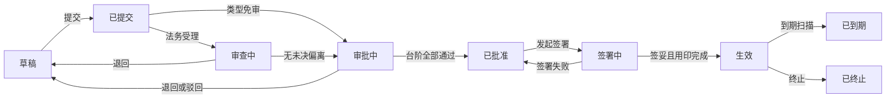
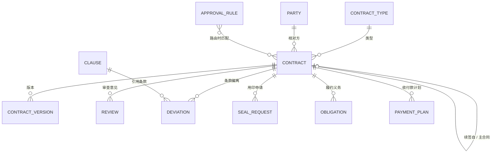
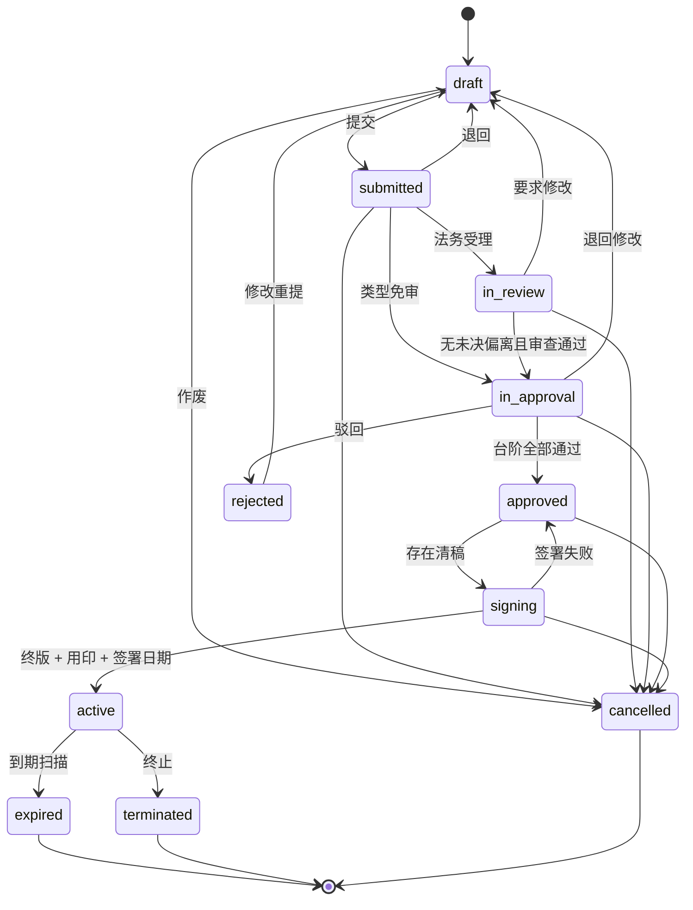

# HotCLM 合同全生命周期管理

# 设计方案

**版本号：V0.9（送审稿）**

**发布日期：2026 年 09 月 07 日**

**编制方：ObjectStack 产品组（AI 架构师）**

**审阅方：维护者**

---

## 版本记录

| 版本号 | 日期 | 修订说明 | 编制人 | 审核 / 确认 |
|---|---|---|---|---|
| V0.9 | 2026-09-07 | 首版送审稿：依据仓库 `DESIGN.md`（架构蓝图）展开为完整业务设计；参照 Ironclad（流程与发起）、Sirion（签后管理）、Agiloft（可配置性）；含第 11 章 14 项待确认事项 | AI 架构师 | 待维护者确认 |

依据文件：`DESIGN.md`（2026-09-07，架构权威）；ObjectStack 平台 17.3 能力与 `docs/PLATFORM_GAPS_FROM_TEMPLATES.md` 缺口清单；HotCRM 3.0 的 `crm_contract` 定义。

---

## 目录

1. 一页纸摘要
2. 建设目标与范围
3. 角色与数据范围
4. 核心业务流程
5. 功能模块设计
6. 业务对象总览
7. 规则设计
8. 权限与安全
9. 集成设计
10. 非功能与运维基线
11. 待确认事项
12. 实施与迭代计划
13. 当前状态
14. 确认方式

---

# 1. 一页纸摘要

- **做什么**：一套面向企业法务、财务、合规与业务部门的合同全生命周期管理系统，把「发起 → 法务审查 → 条款偏离 → 审批 → 签署与用印 → 生效 → 履约义务与收付款 → 变更续签 → 到期终止 → 归档台账」全流程搬到线上，替代现在靠 Word 附件、群聊和 Excel 台账来回传递的做法。买卖双边合同与非交易类合同一并覆盖。
- **怎么做**：基于 ObjectStack 元数据平台构建。组织、账号、权限、审计、附件、审批收件箱、导入导出、通知直接复用平台；合同专属的流程配置、审批矩阵、状态机、条款库、履约与收付款由本系统以元数据内置，口径改动只改配置不改代码。
- **三条产品原则**（取自 Ironclad）：业务自助发起、法务把关不当瓶颈；合同类型即流程，新增一种合同是加一条配置；合同是数据不是文件，义务、付款、到期都是可查询可提醒的记录。
- **与 HotCRM 的关系**：独立产品，可单装。商务信息（金额、期限、续约）以 HotCRM 的销售合同为准，法律状态（审批、用印、履约、归档）以本系统为准；两者并装时销售合同自动交接、签署后自动回写。
- **不做什么**：在线红线编辑器（二期）、电子签引擎（只集成）、供应商准入评价（SRM）、应收应付账（财务系统）。
- **现状**：仓库 `objectstack-ai/hotclm` 已建立，配置域四个对象与十四张开发卡片已落地，本文确认后进入 M1 开发。

# 2. 建设目标与范围

**目标**：合同口径统一（一份台账、一套编号、一套状态）；流程按合同类型可配置；发起到归档全程线上、全程留痕；到期、履约、付款主动提醒而不是靠人记；法务工作量可度量。

**范围**：

| 域 | 内容 |
|---|---|
| 配置 | 合同类型与流程定义、条款库与立场、审批矩阵、相对方主数据、签约主体与部门字典 |
| 签前 | 业务发起表单、法务受理与分派、审查意见、条款偏离、谈判轮次与版本、审批台阶、用印申请、电子签 |
| 签后 | 生效、履约义务、收付款计划与核对、变更补充、续签、到期与终止、归档与台账 |
| 支撑 | 存量合同导入、通知、看板报表、AI 抽取与审查建议（云版）、与 HotCRM 交接 |

**不在本期范围**：在线起草与红线比对编辑器；电子签引擎自建；供应商准入、评价与考核；应收应付账与发票开具；法律案件与诉讼管理；相对方在线门户（平台外部门户能力尚缺）。

**范围分级**：一期（M1–M3）、一期补强（M4）、二期、产品化候选四档，各项归属见第 12 章表 14。

# 3. 角色与数据范围

**表 1 角色与数据范围**

| 角色 | 在系统里做什么 | 能看到的范围 |
|---|---|---|
| 业务承办 | 发起合同、补充材料、催办、跟踪履约、确认收付款事实 | 本人发起或负责履约的合同 |
| 法务经办 | 受理、审查、登记偏离、上传对方版本、发起签署与用印、维护条款库 | 全部合同 |
| 法务负责人 | 高风险偏离与用印审批、分派与改派、SLA 超期处理 | 全部合同 |
| 财务负责人 | 财务口径审批（会签）、维护收付款计划、登记实际收付 | 审批通过及之后阶段的合同 |
| 分管领导 / 总经理 | 大额与高风险合同审批 | 路由到本人的合同 |
| 印章管理员 | 执行用印、登记快递与回收 | 处于签署阶段且需用印的合同 |
| 档案管理员 | 归档编号、台账导出、保留期管理 | 生效及终态合同 |
| 系统管理员 | 维护合同类型、审批矩阵、签约主体、部门与岗位 | 全部 |

数据范围的实现方式：系统按「谁发起、谁经办、谁被路由到」和「岗位」自动放开可见范围，人员变动只改岗位分配不改配置；越权访问被明确拒绝；经办人、审批人、用印人以登录账号为准，由系统盖章，不能手工填写。

# 4. 核心业务流程

图 1 合同主流程与状态（自左向右推进；退回回到草稿；终态为已到期、已终止、已作废）

**表 2 流程步骤与系统保证**

| 步骤 | 谁 | 做什么 | 系统保证 |
|---|---|---|---|
| 1 发起 | 业务承办 | 选合同类型 → 填该类型要求的字段 → 选或建相对方 → 上传首版或按模板起草 → 提交 | 类型必填项齐全、相对方非黑名单、至少一个版本，否则不能提交并逐条提示；提交即盖发起时间、自动编号 |
| 2 受理与路由 | 系统 | 按合同类型与审批矩阵计算审批路径；免审类型直达审批；需审类型按未结合同数最少分派法务经办 | 路由结果写在合同上只读；分派可由法务负责人改派 |
| 3 法务审查 | 法务经办 | 出审查意见（通过 / 要求修改 / 驳回）、登记条款偏离、上传对方红线、记录轮次 | 存在未决偏离不能送审；审查超 SLA 自动提醒并升级 |
| 4 审批 | 直接主管 → 法务负责人 / 财务负责人（会签）→ 分管领导 → 总经理 | 在审批收件箱审批、退回修改或驳回 | 只走矩阵命中的台阶；审批期间合同锁定；任一驳回即终止链路；每一步谁、何时、意见全部留痕 |
| 5 签署与用印 | 法务经办、印章管理员 | 发起电子签或线下签署；提交用印申请；登记签妥版本 | 需用印的类型未完成用印不能生效；签妥版本为终版，此后版本只读 |
| 6 生效 | 系统 | 盖生效时间；按类型默认生成续签提醒义务；按发起时填写的付款安排生成收付款计划；并装 HotCRM 时回写 | 生效后核心条款只读，改动走补充协议 |
| 7 履约 | 业务承办、财务 | 完成义务并上传证据；登记实际收付 | 到期前 7 天与当天提醒；逾期自动标红并汇总到合同 |
| 8 续签 / 终止 / 到期 | 业务承办、法务、系统 | 提前 N 天收到续签提醒，一键发起续签草稿；终止需原因；到期由系统扫描 | 续签是新合同并回链原合同；自动续签类型到期自动生成续签草稿 |
| 9 归档 | 档案管理员 | 填归档编号，导出台账 | 终态且归档后除备注外只读；按类型保留期管理 |

## 4.1 分支流程

| 分支 | 触发 | 处理 |
|---|---|---|
| 法务退回 | 审查意见为「要求修改」 | 合同回到草稿，发起人修改后重新提交，轮次加一 |
| 审批退回修改 | 审批人选择「退回」 | 区别于驳回：回到草稿保留审批记录，重提后从第一台阶重走 |
| 撤回 | 发起人或法务在生效前作废 | 进入已作废终态，理由必填 |
| 补充协议 | 生效合同需要变更 | 新建合同，类型为补充协议，主合同回链；走独立的审批矩阵 |
| 续签 | 到期提醒或手工发起 | 预填原合同信息生成新草稿，`renewed_from` 回链 |
| 先签后补 | 业务已在线下签署 | 见第 11 章第 12 项（待确认） |

# 5. 功能模块设计

## 5.1 合同类型与流程配置

- **界面**：类型列表（名称、编号前缀、方向、类别、是否法务审查、是否用印、签署方式、状态），类型详情四页签：基本信息 / 流程（发起字段、法务审查、用印、签署方式、审查 SLA）/ 模板（模板文件、占位符清单）/ 默认与保留（默认期限、保留年限）。
- **规则**：编号前缀在组织内唯一；停用不删除，存量合同保留类型；类别是流程分类，与 HotCRM 的商务类型不对齐（第 11 章第 6 项）。
- **出厂种子**：NDA、销售、采购、服务、租赁、劳务、框架、补充协议八种。

## 5.2 发起合同（Launch Form）

**表 3 发起表单设计**

| 步 | 字段 | 规则 |
|---|---|---|
| 1 选类型 | 合同类型（仅启用的） | 选定后决定后续字段与流程 |
| 2 基本信息 | 标题、签约主体、部门、金额与币种、是否估算金额、起止日期或期限、摘要 | 核心字段恒必填；类型 `intake_fields` 列出的可选字段（适用法律、付款条款、保密期限、责任上限、自动续约、主合同）按类型显隐与必填 |
| 3 相对方 | 搜索相对方；不存在则内联新建（名称、类型、登记号、联系人） | 黑名单相对方拒绝选择并提示原因；观察名单允许但标记 |
| 4 文件 | 上传首版文件，或勾选「按模板起草」 | 勾选模板时把类型的模板文件与占位符清单作为 v1 挂上，由起草人填写后替换 |
| 5 付款安排（可选） | 期数、计划日期、计划金额、条件 | 生效时自动生成收付款计划 |
| 6 提交 | 「保存草稿」或「立即提交」 | 提交即路由；提交后核心字段锁定，修改需法务退回 |

发起表单是平台的屏幕流，对 AI 开放：输入齐全时可由助手或 MCP 无界面完成，与人工发起走同一条校验。

## 5.3 法务受理与审查

- **界面**：法务工作台四个队列：待受理（已提交未分派）、审查中（我经办）、谈判中（球在对方）、超期。合同详情页的「审查与偏离」页签：审查意见列表（阶段、审查人、结论、对外意见、内部备注）、偏离列表（条款、偏离内容、申请立场、理由、状态）。
- **规则**：受理即分派法务经办并进入审查中；审查结论三种：通过、要求修改（退回草稿）、驳回（作废）；内部备注对发起人不可见；至少一条法务「通过」且无未决偏离方可送审；审查 SLA 按类型天数计，超期提醒经办，超一倍抄送法务负责人。

## 5.4 条款库与偏离（Playbook）

- **界面**：条款库列表（标题、类别、风险级别、适用类别、状态），条款详情三栏：标准文本 / 备选文本 / 底线说明。
- **规则**：偏离登记在合同上，引用一条条款，记录对方要求的立场（标准 / 备选 / 自定义）与理由；偏离状态：待决 → 接受 / 拒绝 / 撤回；接受了「需法务负责人」条款的偏离，自动把法务负责人台阶加入审批路径；有任何待决偏离不能送审。

## 5.5 谈判与版本

- **界面**：详情页「版本」页签为时间线：版本号、类型（草稿 / 我方红线 / 对方红线 / 清稿 / 签妥终版）、提交人、轮次、备注、文件。
- **规则**：上传对方红线即把「当前轮次」记为我方，上传我方红线记为对方；球在对方超过 7 天提醒业务承办催办；送签必须存在一份清稿；签妥终版只能由签署流程或印章管理员登记，登记后所有版本只读。

## 5.6 审批矩阵与审批台阶

审批路径固定五级台阶：直接主管 → 法务负责人 → 财务负责人 → 分管领导 → 总经理。矩阵决定一份合同走哪几级，法务与财务同时命中时为会签（各出一人，任一驳回即终止）。

**表 4 审批矩阵出厂样例（可整表改配置）**

| 规则 | 适用类别 | 方向 | 金额区间 | 仅含偏离 | 法务负责人 | 财务负责人 | 分管领导 | 总经理 |
|---|---|---|---|---|---|---|---|---|
| 小额 | 全部 | 任意 | < 10 万 | 否 | | | | |
| 中额 | 全部 | 任意 | 10 万 ≤ x < 100 万 | 否 | | ✓ | | |
| 大额 | 全部 | 任意 | 100 万 ≤ x < 500 万 | 否 | ✓ | ✓ | ✓ | |
| 特大额 | 全部 | 任意 | ≥ 500 万 | 否 | ✓ | ✓ | ✓ | ✓ |
| 高风险偏离 | 全部 | 任意 | 不限 | 是 | ✓ | | | |
| NDA 免财务 | NDA | 任意 | 不限 | 否 | | | | |

命中多条时取台阶的并集；直接主管恒为第一台阶。

**表 5 三份合同的审批路径示例**

| 合同 | 金额 | 偏离 | 命中规则 | 实际路径 |
|---|---|---|---|---|
| 与某供应商的采购合同 | 8 万 | 无 | 小额 | 直接主管 |
| 与某客户的销售合同 | 260 万 | 无 | 大额 | 直接主管 → 法务负责人 与 财务负责人 会签 → 分管领导 |
| 与某客户的框架合同 | 120 万 | 责任上限条款偏离（高风险） | 大额 + 高风险偏离 | 直接主管 → 法务负责人 与 财务负责人 会签 → 分管领导 |

- **规则**：审批期间合同锁定；审批人可「通过」「退回修改」「驳回」；退回回草稿保留记录，驳回进入已驳回可修改重提；不在岗委派与批量审批由平台审批收件箱提供；审批结论镜像到合同的审批状态字段供列表筛选。

## 5.7 签署与用印

- **电子签**：法务在已批准合同上「发起电子签」，选择提供商与签署方，系统把清稿与签署方送至提供商；回调把状态写回，完成时自动登记签妥终版并盖签署时间。
- **用印**：需用印的类型在签署阶段提交用印申请（印章种类、份数、用途），法务负责人审批后由印章管理员执行，登记用印时间、快递单号与回收确认；用印完成盖合同的用印时间。
- **线下签署**：印章管理员或法务上传签妥扫描件登记为终版并填签署日期。
- **规则**：签妥终版存在、用印（若需）完成、签署日期非空三者齐备方可生效；签署失败回到已批准。

## 5.8 生效与履约义务

- **界面**：详情页「履约与收付款」页签：义务列表（标题、类型、到期日、负责人、状态、证据）；「我负责的履约」列表按到期升序。
- **规则**：生效时按类型默认生成续签提醒义务；义务类型：交付、付款、报告、续签、合规、其他；到期前 7 天与当天提醒负责人；逾期由日任务置为逾期并汇总到合同「逾期义务数」；完成需勾选并可上传证据；可豁免需说明。

## 5.9 收付款计划

- **界面**：财务「收付款计划」三视图：本月到期、逾期、已付；行内登记实际日期与金额。
- **规则**：方向随合同（销售为收、采购为付）；状态：计划 → 到期 → 部分 / 已付 / 逾期；逾期由日任务判定并提醒财务负责人与业务承办；合同汇总计划金额与实际金额；只做计划与事实登记，不做账。

## 5.10 变更、续签、终止

- 补充协议是一份新合同（类别为补充协议，主合同回链），走自己的审批矩阵，生效后在主合同详情页「关联合同」中并列显示。
- 续签：到期前按类型或合同的提前天数提醒；「发起续签」预填原合同信息生成新草稿并回链；自动续签类型到期时系统自动生成续签草稿并提醒。
- 终止：生效合同可终止，终止原因与终止日期必填；终止后义务与未付款项保留但标记。

## 5.11 到期与归档、台账

- 到期由每日扫描判定；非自动续签合同到期置为已到期。
- 归档：终态合同由档案管理员填归档编号后归档；归档后除备注只读；保留期按类型年限计。
- 台账：全字段列表可按类型、方向、部门、相对方、状态、到期区间筛选并导出 CSV / XLSX。

## 5.12 相对方管理

- 相对方独立于 HotCRM 客户：公司、个人、政府机构均可；登记号组织内唯一；联系人电话与银行账号受字段级保护。
- 风险标记：无 / 观察 / 黑名单；黑名单不可用于新合同；配置了核验连接器时记录核验时间。
- 并装 HotCRM 时可链到客户，销售合同交接时自动查找或新建。

## 5.13 存量合同导入

- 导入映射：合同台账（Excel）→ 合同、相对方按名称或登记号匹配或新建；已签合同直接进入生效或已到期，不走审批。
- 云版可用 AI 抽取：上传 PDF 自动提出相对方、金额、起止日期、适用法律、付款条款，人工确认后写入。
- 导入需档案管理员或系统管理员权限，全部行记审计。

## 5.14 通知清单

**表 6 通知事件与接收人**

| 事件 | 接收人 | 通道 |
|---|---|---|
| 合同提交并分派 | 法务经办 | 站内 + 邮件 |
| 审查超 SLA | 法务经办；超一倍抄送法务负责人 | 站内 + 邮件 |
| 法务退回 / 驳回 | 业务承办 | 站内 + 邮件 |
| 审批待办 | 当前台阶审批人 | 站内 + 邮件（平台审批收件箱） |
| 审批通过 / 退回 / 驳回 | 业务承办、法务经办 | 站内 |
| 谈判停滞 7 天 | 业务承办 | 站内 |
| 用印申请待审 / 待执行 | 法务负责人 / 印章管理员 | 站内 |
| 电子签完成 / 拒签 | 法务经办、业务承办 | 站内 + 邮件 |
| 合同生效 | 业务承办、财务负责人 | 站内 |
| 义务到期前 7 天 / 当天 / 逾期 | 义务负责人；逾期抄送业务承办 | 站内 + 邮件 |
| 付款逾期 | 财务负责人、业务承办 | 站内 + 邮件 |
| 续签提醒 | 业务承办、法务经办 | 站内 + 邮件 |
| 合同到期 / 自动生成续签草稿 | 业务承办 | 站内 |

通道现状：站内、邮件、短信为平台已实现通道；钉钉、飞书、企业微信为平台缺口，本期不承诺（第 11 章第 10 项）。

## 5.15 看板与报表

**表 7 看板与指标定义**

| 看板 | 指标 | 口径 |
|---|---|---|
| 法务工作台 | 待受理数、审查中数、超 SLA 数 | 实时计数 |
| 法务工作台 | 平均周转天数（本月 vs 上月） | 生效时间 − 提交时间，按生效月 |
| 法务工作台 | 各阶段合同数 | 按当前状态 |
| 法务工作台 | 谈判停滞数 | 球在对方超 7 天 |
| 管理层 | 生效合同额（按方向、按月） | 生效合同金额合计 |
| 管理层 | 90 天内到期合同数与金额 | 到期日在未来 90 天内的生效合同 |
| 管理层 | 高风险合同数 | 风险级别为高的生效合同 |
| 管理层 | 审批瓶颈 | 各台阶平均停留天数 |
| 财务 | 本月应收 / 应付 | 计划日期在本月的未付计划金额，按方向 |
| 财务 | 逾期金额 | 状态逾期的计划金额合计 |
| 财务 | 相对方未付 Top 10 | 按相对方合计未付 |

报表：合同台账、审批记录明细、义务明细、收付款明细，均可按筛选导出。

## 5.16 AI 助手（云版）

| 能力 | 触发 | 行为 |
|---|---|---|
| 条款抽取 | 上传 PDF 或存量导入 | 提出相对方、金额、起止、适用法律、付款条款与关键条款摘要，人工确认后写入 |
| 版本审查摘要 | 法务打开新版本 | 对比上一版，按条款库类别列出变动并提出偏离草案 |
| 偏离风险建议 | 登记偏离 | 对照标准与备选文本建议风险级别与是否需法务负责人 |
| 合同库问答 | 助手对话 | 在当前用户可见的合同内检索作答并附合同编号 |

四项都只建议不直接写入；开源版无 AI 运行时时按钮与字段不出现，绝不用占位输出冒充结果。

# 6. 业务对象总览

**表 8 业务对象总览**

| 对象 | 说明 | 关系 |
|---|---|---|
| 合同类型 | 一种合同及其流程定义 | 合同引用它 |
| 条款 | 条款库：标准 / 备选 / 底线 | 偏离引用它 |
| 审批规则 | 审批矩阵的一行 | 路由时读取 |
| 相对方 | 合同的另一方 | 合同引用它；可链 HotCRM 客户 |
| 合同 | 主对象，携带状态与阶段时间戳 | 版本、审查、偏离、用印申请、义务、收付款从属于它；续签与主合同自引用 |
| 合同版本 | 一份文件及其类型与轮次 | 从属于合同 |
| 审查意见 | 法务 / 财务 / 合规 / 业务的审查结论 | 从属于合同 |
| 条款偏离 | 对某条条款的偏离与决定 | 从属于合同，引用条款 |
| 用印申请 | 印章种类、份数、执行记录 | 从属于合同 |
| 履约义务 | 一项到期事项 | 从属于合同 |
| 收付款计划 | 一期计划与实际 | 从属于合同 |
| 审批请求 / 审批动作（平台） | 审批链留痕 | 平台对象，引用合同 |
| 审计日志 / 活动 / 评论（平台） | 变更留痕、讨论 | 平台对象 |

图 2 对象关系（实体名为业务名；机器名见 `DESIGN.md` §03）

# 7. 规则设计

## 7.1 合同状态机

图 3 合同状态机（每条转换的守卫在写入层强制，界面隐藏按钮只是辅助）

**表 9 状态转换守卫**

| 转换 | 守卫 |
|---|---|
| 草稿 → 已提交 | 类型必填字段齐全；相对方非黑名单；至少一个版本或类型带模板 |
| 已提交 → 审查中 | 类型需法务审查；已分派法务经办 |
| 已提交 → 审批中 | 类型免审 |
| 审查中 → 审批中 | 无待决偏离；至少一条法务审查结论为通过 |
| 审批中 → 已批准 / 已驳回 / 草稿 | 仅由审批流写入 |
| 已批准 → 签署中 | 存在清稿版本 |
| 签署中 → 生效 | 存在签妥终版；需用印时用印时间非空；签署日期非空 |
| 生效 → 已到期 | 仅日任务 |
| 生效 → 已终止 | 终止日期与原因必填 |
| 任一生效前状态 → 已作废 | 理由必填 |

## 7.2 编号规则

格式 `<类型前缀>-<年份>-<四位流水>`，如 `PUR-2026-0042`；流水按类型按年从 1 起；提交时生成，此后只读；补充协议使用自己的前缀并在主合同上可见。平台自动编号只支持固定格式，本规则由写入钩子生成（第 11 章第 5 项）。

## 7.3 审批路由算法

1. 取合同的类别、方向、金额、是否含已接受偏离。
2. 遍历启用的审批规则，按优先级：类别匹配（规则未限定视为匹配）、方向匹配（任意视为匹配）、金额落在区间、若规则「仅含偏离」则要求合同含已接受偏离。
3. 命中规则的四个台阶标记取并集，写到合同的路由标志。
4. 审查阶段接受了「需法务负责人」条款的偏离，追加法务负责人标志。
5. 审批流按标志逐级进入：直接主管恒走；法务负责人与财务负责人同时为真时会签；分管领导、总经理按标志。

## 7.4 计时口径

| 计时 | 起点 | 终点 | 用途 |
|---|---|---|---|
| 审查 SLA | 进入审查中 | 出审查结论 | 超类型天数提醒，超一倍升级 |
| 谈判停滞 | 最近一次轮次切换到对方 | 对方版本上传 | 超 7 天提醒 |
| 各台阶停留 | 进入台阶 | 该台阶决定 | 审批瓶颈看板 |
| 周转 | 提交时间 | 生效时间 | 平均周转天数 |
| 到期预警 | 到期日 − 提前天数 | 到期日 | 续签提醒 |

日期差由每日任务计算并盖戳，不用公式字段（平台公式库暂无日期差函数）。

# 8. 权限与安全

**表 10 权限矩阵**（R 读 · C 建 · U 改 · D 删；括号为行级范围）

| 对象 | 业务承办 | 法务 | 财务 | 印章 | 档案 | 管理员 |
|---|---|---|---|---|---|---|
| 合同 | RCU（本人，草稿 / 已提交可改） | RCU（全部） | RU（已批准及之后，法律字段只读） | R（签署中） | RU（终态，归档字段） | RCUD |
| 版本 | RC（本人合同） | RCU | R | R | R | RCUD |
| 审查意见 | R（不含内部备注） | RCU | RCU（财务阶段） | — | R | RCUD |
| 偏离 | RC（本人合同） | RCU | R | — | R | RCUD |
| 用印申请 | RC（本人合同） | RCU | — | RU（执行） | R | RCUD |
| 履约义务 | RU（本人负责） | RCU | R | — | R | RCUD |
| 收付款计划 | R（本人合同） | RC | RCU | — | R | RCUD |
| 相对方 | R（不含银行与电话） | RCU | RU（银行信息） | — | R | RCUD |
| 类型 / 条款 / 矩阵 | R | R（条款 RCU） | R | R | R | RCUD |

- 合同默认仅发起人可见，法务全见，财务在审批通过后可见，印章与档案按阶段可见，领导按路由可见；部门负责人经「本人及下属」范围看到下属发起的合同（企业版能力，开源版退化为仅本人）。
- 字段级保护：相对方银行账号与联系电话对业务承办、印章、档案隐藏；审查内部备注对业务承办与财务隐藏；风险级别与责任上限对业务承办只读；路由标志、审批状态与阶段时间戳对所有人只读。
- 审计：状态变更、审批动作、用印执行、终版登记、归档、导入全部进平台审计日志；相对方敏感字段读取落审计。
- 平台账号体系提供密码策略、登录失败锁定、SSO 接入（企业版）。

# 9. 集成设计

## 9.1 电子签

| 项 | 内容 |
|---|---|
| 提供商 | Docusign（首发）；契约锁、法大大、e签宝按同一契约追加 |
| 发起 | 合同「发起电子签」动作 → 平台可靠 HTTP 出站 → 提供商创建信封；请求含合同编号、清稿文件、签署方（我方签约主体、相对方联系人）、签署顺序 |
| 回调 | 提供商 → 平台 API 触发流；状态映射：已发送 / 已完成 / 已拒签 / 已作废；完成时下载签妥文件登记终版并盖签署日期 |
| 配置 | 提供商与凭证在系统设置中维护，不进代码与元数据 |
| 边界 | 不自建签署引擎；提供商不可用时退回线下签署路径 |

## 9.2 与 HotCRM 交接

**表 11 销售合同交接映射**

| HotCRM `crm_contract` | HotCLM `clm_contract` | 方向 |
|---|---|---|
| 进入「审批中」 | 新建，类别销售、方向销售 | CRM → CLM |
| 客户 | 相对方（按登记号或名称查找或新建，回链客户） | CRM → CLM |
| 合同金额 / 起止日期 / 付款条款 | 金额 / 起止 / 付款条款 | CRM → CLM（以 CRM 为准） |
| 合同类型 | 合同类型（按映射表） | CRM → CLM |
| 状态 = 生效、签署日期、文件 | 生效时回写 | CLM → CRM（以 CLM 为准） |

方向规则：商务信息以 HotCRM 为准，法律状态以 HotCLM 为准，同一字段永远只有一个可编辑侧。交接流程只在「随 HotCRM 组合」装配时存在，单装不含。

## 9.3 其他

- 相对方核验：企查查 / 天眼查连接器（可选），写核验时间与风险标记。
- 通知通道：站内、邮件、短信；即时通讯通道待平台提供。
- 导出：台账与明细 CSV / XLSX；打印与 PDF 待平台提供。

# 10. 非功能与运维基线

| 项 | 目标值（待确认） |
|---|---|
| 数据量 | 单组织 5 万份合同、50 万版本文件、100 万义务与计划行内列表与看板秒级响应 |
| 附件 | 单文件 ≤ 50 MB；对象存储可切换本地 / S3 / OSS |
| 可用性 | 与平台一致；日任务失败可重跑且幂等 |
| 备份 | 数据库与对象存储每日备份；归档合同不可变 |
| 语言 | 简体中文默认，英文完整；界面文案不含内部代号与异常原文 |
| 移动端 | 审批与查看走响应式；专用移动端不在本期 |
| 审计保留 | 与平台一致，不少于合同保留期 |
| 升级 | 元数据包升级不改客户数据；客户定制走覆盖层不 fork |

# 11. 待确认事项

每项给出产品默认口径与备选，请逐条回复「同意默认」「改为 X」或「删除」。

**表 12 待确认事项**

| # | 事项 | 产品默认 | 备选 | 建议 |
|---|---|---|---|---|
| 1 | 财务对已批准合同的写权限 | 可改，但法律字段与状态只读 | 收付款计划独立权限，财务不可改合同 | 默认；M1 验证字段级只读能锁住状态 |
| 2 | 同部门可见性 | 不做，仅「本人及下属」 | 按客户以团队规则开放部门内可见 | 默认，进客户定制层 |
| 3 | 审批台阶数 | 固定五级，矩阵选台阶 | 矩阵驱动任意台阶 | 默认；首个客户要第六级再改 |
| 4 | 相对方与 HotCRM 客户 | 独立相对方，可链客户 | 并装时直接复用客户 | 默认 |
| 5 | 合同编号 | 类型前缀 + 年 + 四位流水，钩子生成 | 平台单一流水 | 默认 |
| 6 | 类别与 HotCRM 类型 | 不对齐，交接时映射 | 强制一致 | 默认 |
| 7 | 业务承办能否上传对方红线 | 不能，由法务上传 | 允许并标记来源 | 默认 |
| 8 | 用印是否可按类型关闭 | 可，类型上开关 | 全部合同必须用印 | 默认 |
| 9 | 电子签首选提供商 | Docusign 首发 | 契约锁 / 法大大 / e签宝 首发 | 国内客户优先时改为契约锁 |
| 10 | 即时通讯通知 | 本期不承诺 | 等平台通道 | 默认 |
| 11 | 默认币种与语言 | CNY，简体中文 | USD，英文 | 默认 |
| 12 | 先签后补 | 允许：档案或法务通过「补录」直接进入生效，标记补录并留痕 | 不允许，必须走流程 | 默认（真实需求高频） |
| 13 | 归档保留期 | 类型上配置，默认 10 年 | 统一固定 | 默认 |
| 14 | 补充协议是否走独立矩阵 | 走自己的类别规则 | 沿用主合同路径 | 默认 |

# 12. 实施与迭代计划

**表 13 里程碑与验收**

| 里程碑 | 内容 | 验收 |
|---|---|---|
| M1 数据与权限骨架 | 11 个对象、状态机守卫、8 岗位 6 权限集、共享与字段级保护、配置域种子 | 校验、规范、类型检查全绿；业务承办互相看不到合同；财务看不到审查中合同 |
| M2 发起与审批 | 发起表单、路由、审批台阶、用印、法务工作台、合同详情页、全量演示数据 | 走通 发起 → 受理 → 偏离 → 会签 → 用印 → 生效，审批与审计记录齐全 |
| M3 签后与分析 | 生效处理、义务与收付款、续签到期扫描、四个数据集、三个看板、中英双语 | 演示数据下无空图；到期与逾期提醒在收件箱可见 |
| M4 集成与发布 | 电子签、HotCRM 交接、AI 助手、存量导入、文档站、截图、市场发布 | 一条命令跑起；市场一键安装；需求逐条对应功能清单与测试 |

**表 14 范围分级**

| 档 | 事项 |
|---|---|
| 一期（M1–M3） | 第 5 章 5.1–5.12、5.14、5.15；第 7、8 章全部 |
| 一期补强（M4） | 电子签、HotCRM 交接、AI 助手、存量导入、发布 |
| 二期 | 在线红线编辑器、模板一键生成、打印 PDF、即时通讯通道、入站邮件成版本 |
| 产品化候选 | 相对方在线门户、多主体集团合并台账、外部审计员只读访问 |

# 13. 当前状态

仓库 `objectstack-ai/hotclm` 已建立并推送首个提交：`defineStack` 入口、CI 门槛、架构蓝图 `DESIGN.md`、`AGENTS.md` 约定、十四张开发卡片，以及配置域四个对象（合同类型、条款、审批规则、相对方，共 50 个字段）。四道门槛（校验、规范、类型检查、构建）在平台 17.3 上全绿。尚未开始：合同域与签后域对象、权限、流程、界面、种子数据。本文确认后按第 12 章进入 M1。

# 14. 确认方式

请对第 11 章表 12 的 14 项逐条回复；确认后本文升为 V1.0 作为一期基准，同步修订 `DESIGN.md` 中对应章节；后续变更走版本记录，只增不改。
